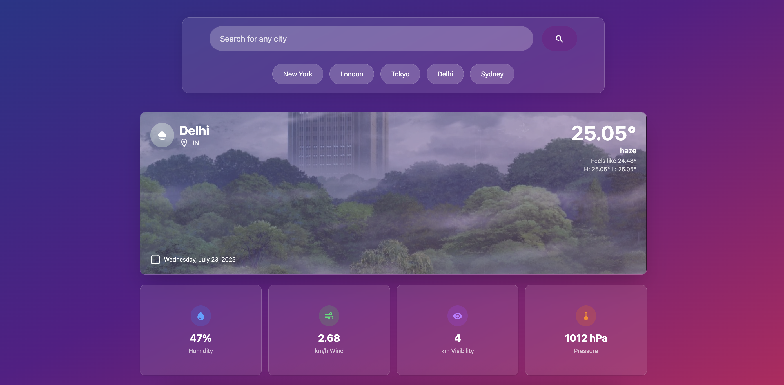

# 🌤️ Weather Widget Web App

A sleek, modern weather web app that displays real-time weather data for any city using the OpenWeatherMap API. Styled with a soft gradient UI and built with responsive components.



---

## 🚀 Features

- 🌍 Search weather by city name
- 🌡️ Displays temperature, humidity, pressure, wind, and visibility
- ⛅ Dynamic background based on weather condition
- ⚡ Responsive UI optimized for desktop and mobile

## Tech Stack

- **Frontend:** React + Vite
- **Styling:** Tailwind CSS, shadcn UI
- **Weather API:** OpenWeatherMap API

---

## 📦 Installation

To get started with **Weather Widget**, clone the repository and install dependencies:

```bash
git clone https://github.com/your-username/weather-widget.git
cd weather-widget
npm install
```

---

## 🔑 Setup API Key

1. Sign up for a free OpenWeather API key at [OpenWeatherMap](https://openweathermap.org/api).
2. Create a `.env` file in the root of your project and add your API key:

   ```
   VITE_OWM_KEY=your_api_key_here
   ```

3. You're ready to go! Run the app locally:

   ```bash
   npm run dev
   ```

---

## Acknowledgements
OpenWeatherMap for the weather API.
Tailwind CSS for the styling.
shadcn UI for UI components.
The React and Vite communities for their amazing tools and documentation.
